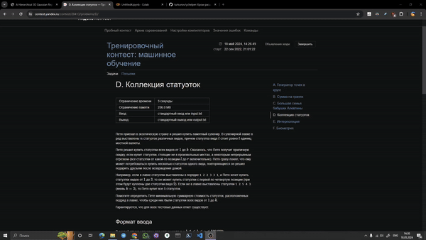

# ychelper
Хром-расширение для Яндекс.Контеста

### Превью

### Инструкция по установке
* Склонируйте локально репозиторий
* Перейдите в `chrome://extensions/` и включите режим разработчика
* Нажмите на `Загрузить распаковаанное расширение` и выберете склонированный репозиторий
* Нажмите на `Обновить`

### Что оно может?
* `Скопировать тесты`: Копирует в буфер тесты к задаче в формате python-списка из кортежей: 

    